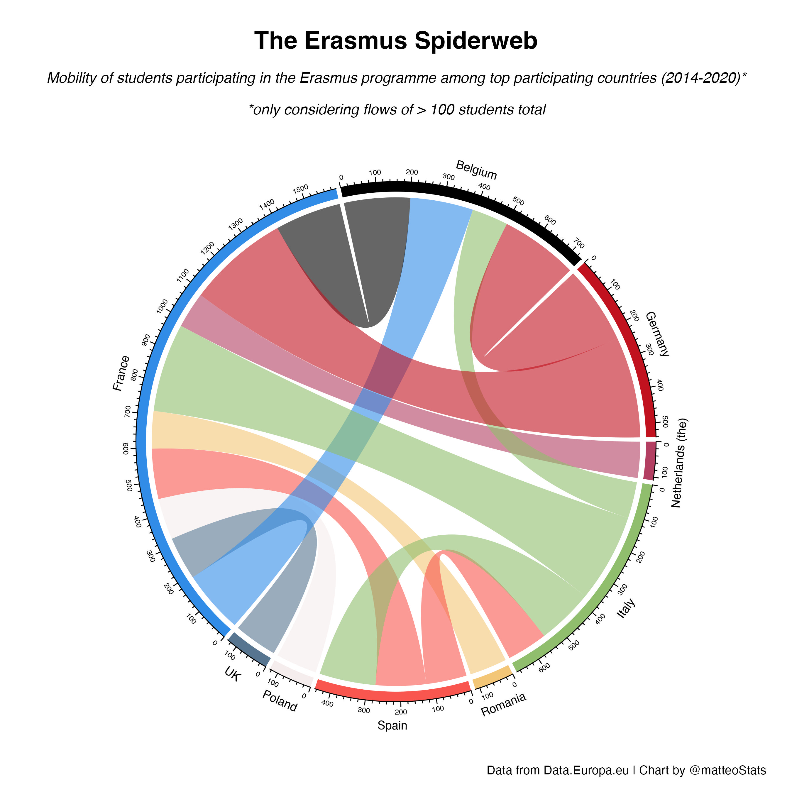

<h1 style="font-weight:normal" align="center">
  &nbsp;My #TidyTuesday&nbsp;
</h1>

&nbsp;&nbsp;&nbsp;

My contributions to the [#TidyTuesday challenge](https://github.com/rfordatascience/tidytuesday), a weekly social data project that focuses on understanding how to summarize and arrange data to make meaningful and/or beautiful charts with `{ggplot2}`, `{tidyr}`, `{dplyr}` and other tools that are part of the [`{tidyverse}`](https://www.tidyverse.org/) ecosystem. The project was founded in 2018 by [Thomas Mock](https://thomasmock.netlify.com/) and organized by the [R4DS ("`R` for Data Science") online learning community](https://twitter.com/r4dscommunity). The intent is to provide a safe and supportive forum to practice their wrangling and data visualization skills.  

## 2023

### [Week 1](https://github.com/MatteoLarrode/TidyTuesday/blob/main/2023/Week1/) 🎓 Erasmus 

Bring your own data from 2022!

| Week | Date | Data | Source | Article
| :---: | :---: | :--- | :--- | :---|
| 1 | `2022-01-03` | [Erasmus student mobility](https://github.com/rfordatascience/tidytuesday/tree/master/data/2022/2022-03-08) | [Data.Europa.eu](https://data.europa.eu/data/datasets/erasmus-mobility-statistics-2014-2019-v2?locale=en) | [Wimdu.co](https://www.wimdu.co.uk/blog/discover-popular-erasmus-destinations) |

### [Week 2](https://github.com/MatteoLarrode/TidyTuesday/blob/main/2023/Week2/) 🐦 FeederWatch

| Week | Date | Data | Source | Article
| :---: | :---: | :--- | :--- | :---|
 2 | `2023-01-10` | [FeederWatch data](https://github.com/rfordatascience/tidytuesday/tree/master/data/2023/2023-01-10) | [FeederWatch](https://feederwatch.org/explore/raw-dataset-requests/) | [Citizen Data Report Project FeederWatch](https://www.frontiersin.org/articles/10.3389/fevo.2021.619682/full) |
 

### [Week 3](https://github.com/MatteoLarrode/TidyTuesday/blob/main/2023/Week3/) 🎨 Art History

| Week | Date | Data | Source | Article
| :---: | :---: | :--- | :--- | :---|
| 3 | `2023-01-17` | [Art history data](https://github.com/rfordatascience/tidytuesday/tree/master/data/2023/2023-01-17) | [arthistory data package](https://saralemus7.github.io/arthistory/) | [Quantifying Art Historical Narratives](https://github.com/hollandstam1/thesis/blob/main/_book/Quantifying-Art-Historical-Narratives.pdf) |

### [Week 4](https://github.com/MatteoLarrode/TidyTuesday/blob/main/2023/Week4/) 🐺 ALONE

| Week | Date | Data | Source | Article
| :---: | :---: | :--- | :--- | :---|
| 4 | `2023-01-24` | [Alone data](2023-01-24/readme.md) | [Alone data package](https://github.com/doehm/alone) | [Datasets from the survival TV series](https://gradientdescending.com/alone-r-package-datasets-from-the-survival-tv-series/) |

### [Week 5](https://github.com/MatteoLarrode/TidyTuesday/blob/main/2023/Week5/) 🐱 Pet Cats UK

| Week | Date | Data | Source | Article
| :---: | :---: | :--- | :--- | :---|
| 5 | `2023-01-31` | [Pet Cats UK](2023-01-31/readme.md) | [Movebank for Animal Tracking Data](https://www.datarepository.movebank.org/handle/10255/move.882) | [Cats on the Move](https://themarkup.org/data-is-plural/2023/01/25/from-jazz-solos-to-cats-on-the-move#:~:text=Giuseppe%20Sollazzo%5D-,Cats%20on%20the%20move,-.%20Between%202013) |

